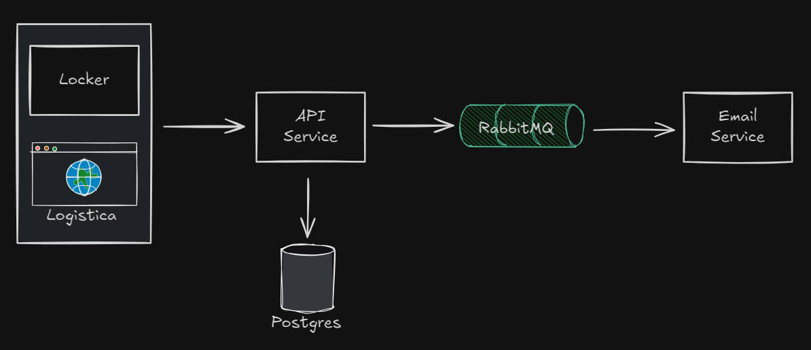

# Sher-Lock
É um serviço de **armários de encomendas** distribuídos estrategicamente pela cidade, proporcionando uma solução eficiente e conveniente para o **recebimento de pacotes**. O funcionamento do sistema é **simples** e **seguro**:

1. 🏢 **Empresas de logística:** As empresas de logística podem depositar as encomendas nos armários Sher-Lock, distribuídos em pontos acessíveis e de fácil localização na cidade. Cada armário possui compartimentos de tamanhos variados, adequados para diferentes tipos de pacotes.

2. 🙋 **Clientes:** Os clientes recebem um QR Code por e-mail assim que a compra é feita. Com esse código, é possível retirar a encomenda de forma rápida e segura, sem a necessidade de interação com atendentes ou de cumprimento de horários específicos.

O **Sher-Lock** oferece, assim, uma solução prática tanto para empresas de logística quanto para consumidores, **otimizando o processo de entrega e retirada de encomendas**, reduzindo filas e aumentando a conveniência para todos os envolvidos.

## Arquitetura
